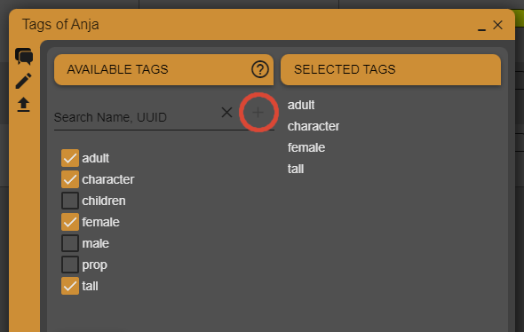

.. _project-contributions-tags:

================
Tags
================

.. toctree::
   :maxdepth: 2

With **Tags** you can tag your assets. This can help you to find the asset you are looking for faster. All tags are globally available in your current project. New tags can be created in the Contribution dialog of your asset by typing the new tag in the search bar and hit the plus sign right to the search bar (red border). The new tag is automatically assigned to the current asset.

To use this attribute, you need to purchase a 'Grid Column Tags' licence.
