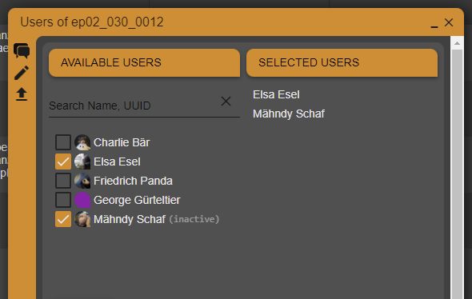

.. _project-contributions-users:

================
Users
================

.. toctree::
   :maxdepth: 2

With the **Users** attribute you can add a single or a group of users to an asset by simply selecting them from a list of all project members.

Users that has been removed from the project can not be selected and will be marked as '(inactive)' in the list of available users. In case a user was already selected before he left the project, the user will still be selected but needs to be removed before the list of selected users can be changed.

To use this attribute, you need to purchase a 'Grid Column Users' licence.
