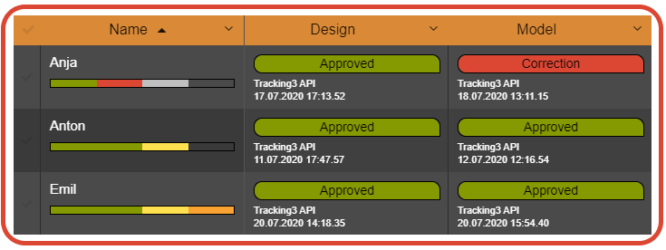

.. _project-settings-asset-definition:

================
Asset Definition
================

.. toctree::
   :maxdepth: 2

.. cssclass:: tr3-section

----------
Definition
----------
An **Asset Definition** can be seen as a kind of a table. It has columns, we name them **Attributes** and **Assets** are the rows of that table.

The same **Asset Definition** can be used in many data grids, for example an **Asset Definition** 'Shot' can be used in multiple sequences to display many shots. They all have the same definition, but are different **Assets**.

.. cssclass:: tr3-section

-----
Label
-----
This is the label of your **Asset Definition** or table. But it is not the label of a **View**.

.. _main-attribute:
.. cssclass:: tr3-section

--------------
Main Attribute
--------------
In this list are all **Attributes** listed, that are defined for this **Asset Definition**.
This is the **Attribute** you can identify an **Asset Definition** later within your data grid. It's a good practice to use the 'Asset Name' **Attribute**, but you don't have to.
The **Attribute** you select here will show up in the **Parent Asset Source** field of an **Attribute** of the type **Parent Asset**.
