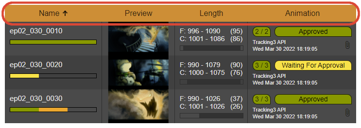

.. _project-settings-attribute:

=========
Attribute
=========

.. toctree::
   :maxdepth: 2

An **Attribute** is a property of an :doc:`/docs/Project/Settings/AssetDefinition/index` or in other words, if an :doc:`/docs/Project/Settings/AssetDefinition/index` is a table then an **Attribute** would be one column of that table.

The same :doc:`/docs/Project/Settings/AssetDefinition/index` can be used in many data grids, for example an :doc:`/docs/Project/Settings/AssetDefinition/index` 'Shot' can be used in multiple sequences to display many shots. They all have the same definition, but are different **Assets**.

-----
Label
-----
This is the label of your **Attribute** or column.

----
Type
----
There are many different types of **Attributes**, each for a different use case.

Asset Name
==========
This type shows the name or label of an row or asset. The colored bar shows the current state of other **Attributes** of type `State`_ in this data grid.

Asset Occurrence is included in the free tier.

Asset Occurrence
================
This attribute is the reverse side of `Assets Used`_ showing what assets uses the current asset. 'Asset Occurrence' can not directly changed and updates automatically if the asset gets selected in an 'Assets Used' attribute.

Asset Occurrence is included in the free tier.

Assets Used
===========
With the help of 'Assets Used' you can assign other assets to be used and linked to the current asset. This is useful to show your artists what assets they need, to start working on a specific task. An 'Assets Used' attribute in combination with a `Asset State Definitions`_ of a **State** attribute adds a process indicator to the **State** (blue border) showing you if all used assets for the current asset are available. You can link the same asset multiple times to the current asset. This way you know that you need a certain asset multiple times in a shot for example. This works great in an automated shot setup process.

In the settings of 'Assets Used' you can choose what :doc:`Asset Definitions</docs/Project/Settings/AssetDefinition/index>` the 'Assets Used' **Attribute** should use. This option makes is easier to find the correct asset because the pool of all assets will be reduced to the assets you really need. You can adjust this settings at any time later on.

You may have noticed, that the number of assets in the 'Assets Used' **Attribute** (red border) does not match the number shown in the box on the left side of **State** 'Animation' and 'Rendering' (blue border). That is because both **Status** attributes are using different **Asset State Definitions**. You can read more about `Asset State Definitions`_ here.

Adding up to two assets is included in the free tier. For more assets you need to purchase a 'Grid Column Assets Used' licence.

Category
========
With a 'Category' attribute you can add really simple labels to your assets, like difficulties or a responsible studio for a task or asset.

To use this attribute, you need to purchase a 'Grid Column Category' licence.

Checkbox
========
A 'Checkbox' can be used to mark a step as complete or available. Checkboxes can be changed directly in the grid.

To use this attribute, you need to purchase a 'Grid Column Checkbox' licence.

Date
====
The 'Date' attribute does have two modes, using it as 'Due Date' (left side in the picture below) or as normal 'Date' (right side in the picture below). You can distinguish the modes in the settings.

Using 'Due Date' adds a due date input. Using this input Tracking3 evaluates the time left or overdue and shows a text note and a color indicator on the left in different colors to indicate how much time is left before hitting the due date.

Using this attribute as a normal 'Date' (left side in the picture), only the completion date is available as input.

To use this attribute, you need to purchase a 'Grid Column Date' licence.

Duration
========
In a **Duration** type you can insert the length of a shot including the footage start, footage end, clip in and clip out.
As you can see in the example below the first shot has a source footage starting from frame 996 to frame 1090, with a total length of 95 frames. But the clip that actually will be used in production starts from frame 1001 to frame 1086, with a total length of 86 frames.

To use clip in and clip out points you need to purchase a 'Grid Column Duration' licence.

.. image:: ./type_duration.png
    :class: help-tip

Json
====
In a 'Json' attribute (JavaScript Object Notation) you can persist complex machine readable data. That is why you can not edit the Json value within the web-interface, but of cause you can display it.

To use this attribute, you need to purchase a 'Grid Column Json' licence.

Number
======
With the 'Number' attribute you can add formatted number of any kind and meaning to your data grid. You can define the format of the number and how many integer and decimal places your number should have.

To use this attribute, you need to purchase a 'Grid Column Number' licence.

Parent Asset
============
Here you can define a hierarchy between **Asset Definitions**. For example an :doc:`/docs/Project/Settings/AssetDefinition/index` 'Shot' belongs to an :doc:`/docs/Project/Settings/AssetDefinition/index` 'Sequence'. Using the **Parent Asset** attribute you can achieve this.

In the example below you can see a data grid for the :doc:`/docs/Project/Settings/AssetDefinition/index` 'Shot' with an **Attribute** called 'Sequence'. This **Attribute** 'Sequence' is of the type of **Parent Asset** and pointing to the **Main Attribute** of an :doc:`/docs/Project/Settings/AssetDefinition/index` called 'Sequence'.

Parent Asset is included in the free tier.

Parent Asset Definition
-----------------------
Select the :doc:`/docs/Project/Settings/AssetDefinition/index` you like to use as the hierarchy parent for your current selected :doc:`/docs/Project/Settings/AssetDefinition/index`.

Parent Attribute
----------------
Select the **Main Attribute** of the Parent Asset Definition, which can only be the `Asset Name`_ attribute of that :doc:`/docs/Project/Settings/AssetDefinition/index`.

Preview
=======
Uploading images to this attribute will generate previews that will be displayed in your data grid.

To use this attribute, you need to purchase a 'Grid Column Preview' licence.

State
=====
With this attribute you can show the different states of a single process in production.

You can order your **States** by drag and drop them. We recommend to place the first step at the top of the list of different **States** and the last one at the bottom. Order is important when using **Asset State Definitions**, because every state above in the list than the selected state is interpreted as not ready and marked as red. The state itself and everything below is interpreted as ready and marked as green.

State is included in the free tier.

.. image:: ./type_state.png
    :class: help-tip

Asset State Definitions
-----------------------
To use **State** in combination with `Assets Used`_ to get a process indicator next to the corresponding **State** you need to define at least one **Asset State Definition**, otherwise the data grid will not display any process indicator regardless if any assets are linked in an `Assets Used`_ attribute or not. You can define as many as you like for different :doc:`Asset Definitions</docs/Project/Settings/AssetDefinition/index>` and for different **State** attributes.

Imagine a shot of an animation movie where we need some characters and some props for the animation step. Setting up **Asset State Definitions** could look like the picture below. We set the :doc:`/docs/Project/Settings/AssetDefinition/index` to 'Character', the **Attribute** to 'Rig' and the `State`_ to 'Approved' because we like to mark approved character rigs as the minimal requirements for our animation step. Doing so, all liked characters with an approved (or higher) rig will add some green to the progress indicator next to the animation step. Character rigs that are not approved will add some blank space to the progress indicator. The order of your **States** is important at this point.

Tags
====
With **Tags** you can tag your assets. This can help you to find the asset you are looking for faster. All tags are globally available in your current project. New tags can be created in the :doc:`Contribution</docs/Project/Contributions/index>` dialog of your asset by typing the new tag in the search bar and hit the plus sign right to the search bar. The new tag is automatically assigned to the current asset.

To use this attribute, you need to purchase a 'Grid Column Tags' licence.

Text
====
This is useful for some general notes or descriptions.

Text is included in the free tier.

.. image:: ./type_text.png
    :class: help-tip

Users
=====
With the **Users** attribute you can add a single or a group of users to an asset by simply selecting them from a list of all project members.

To use this attribute, you need to purchase a 'Grid Column Users' licence.

-----
Width
-----
Is the width of an **Attribute** column it has by default in a data grid.

------
Pinned
------
You can pin **Attributes** to the left or right side of a data grid. Pinned **Attributes** will always be visible, even on large data grids.
