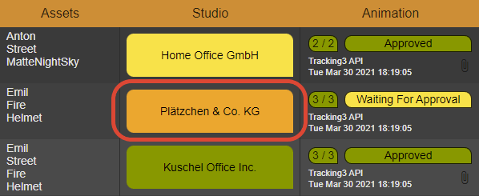

.. _project-settings-category:

==========
Category
==========

.. toctree::
   :maxdepth: 2

A **Category** helps you to categorize assets into logical groups. For example you can use **Categories** to distinguish between asset difficulties or studios associated with an asset.

----------
Label
----------
This is the label of your **Category**.

----------
Text Color
----------
Text colors is used to enhance the readability for darker background colors with a lighter text color.

----------------
Background Color
----------------
It is a good practice to have different background colors for different **Category**. This way you can gather information faster, without having to read the label of each **Category**.
