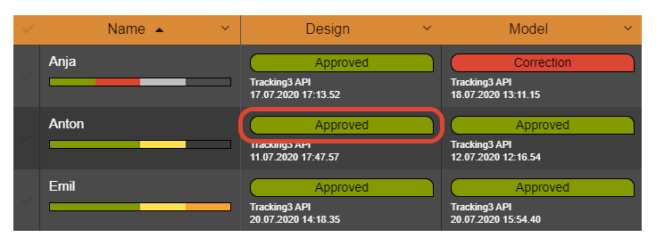

.. _project-settings-state:

==========
State
==========

.. toctree::
   :maxdepth: 2

A State reflects the different steps of a process.

----------
Label
----------

This is the label of your State or process step.

----------
Text Color
----------

Text colors is used to enhance the readability for darker background colors with a lighter text color.

----------------
Background Color
----------------

It is a good practice to have different background colors for different states. For example 'Handout' and 'In Progress' should have different colors. But you should use the same color for the same State over all Attributes. For example 'Animation' and 'Compositing' both have a state 'Handout' and should have the same color. This way you can see the process without having to read the label of each state.
