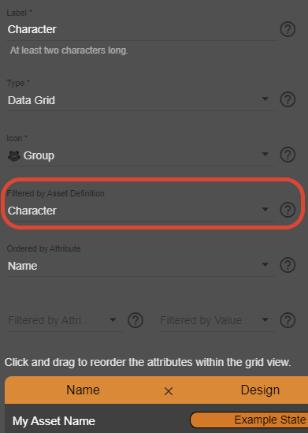
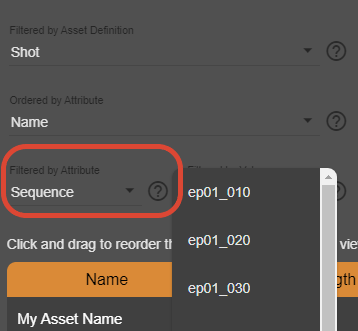
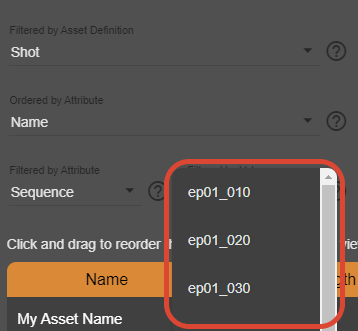

.. _project-settings-view:

==========
View
==========

.. toctree::
   :maxdepth: 2

With **Views** you can structure your project and create data grids to show it's content like your assets and their progress. It depends on you and your project how you order and name views. You can also create a hierarchy like folder structure of views. It is totally up to you.

----------
Label
----------
This is the label of your View.

----------
Type
----------
This is how a **View** behaves. Currently we support two different behaviors:
- A **Data Grid** is like a table. This is the right way to go in the most cases.
- A **Folder** has no special abilities. But it will help you to structure your projects.

----------
Icon
----------
This is a visual representation and does not change the behavior of a **View**. A good practice is to use an icon that represents the content of a **View** as close as possible.

----------------------------
Filtered by Asset Definition
----------------------------
Choose one of the :doc:`Asset Definitions</docs/Project/Settings/AssetDefinition/index>` you have defined in 'Project Settings > Asset Definitions'.

For example, if you want to manage characters in your project, first create a corresponding **Asset Definition** under 'Project Settings > Asset Definitions'. Then you can select the **Asset Definition** you just created for the characters here and assign some or all of the :doc:`Attributes</docs/Project/Settings/Attribute/index>` of this **Asset Definition** to this **View**. As soon as this is done, you will find this **View** on the left in the navigation and can open this **View** there to add your characters.

--------------------
Ordered by Attribute
--------------------
In the most cases you would like to order a data grid by something, for example the name of an :doc:`/docs/Project/Settings/AssetDefinition/index`.

This field can be left empty.

---------------------
Filtered By Attribute
---------------------
When you have select an :doc:`/docs/Project/Settings/AssetDefinition/index` in the **Filtered by Asset Definition** list you will see in this list the :ref:`main-attribute` and all Attributes of the types State or Parent Asset of the selected Asset Definition.
This field can be left empty, if you don't like to filter anything in this View.

Lets assume you want to create a new view for multiple shots of a sequence. You already have an Asset Definition 'Shot' and you have selected it in Filtered by Asset Definition. In that Asset Definition you have also an Attribute called 'Sequence' of the type Parent Asset. This Attribute is shown in the Filtered by Attribute list and you can select it. For the last step you need to select a Value filtered By you would like to filter for. In this example this could be the name of a sequence. This sequence has to exist already in your data grid for sequences.

For more information have a look in the Filtered by Value section.

-----------------
Filtered by Value
-----------------
Here you can select - already defined! - Assets of an Asset Definition (see Filtered by Asset Definition).
This list can be empty, if you don't like to filter anything in a View, but it is required if you select something in Filtered by Attribute.

For example, if you would like to create a view of shots of a sequence, you have to select your 'Shot' Asset Definition in the Filtered by Asset Definition list and an Attribute of the type Parent Asset pointing to your 'Sequence' Asset Definition in the Filtered by Attribute list. Make sure you already define some Assets in the 'Sequence' Asset Definition, otherwise this list stays empty.

You need to create the values you want to filter by before you can select them in this list!

--------------------------------------
Is collapsed if this View has children
--------------------------------------
If enabled (default) a View will be collapsed in the navigation bar. If disabled all child views of this View will be instantly visible, if any.
